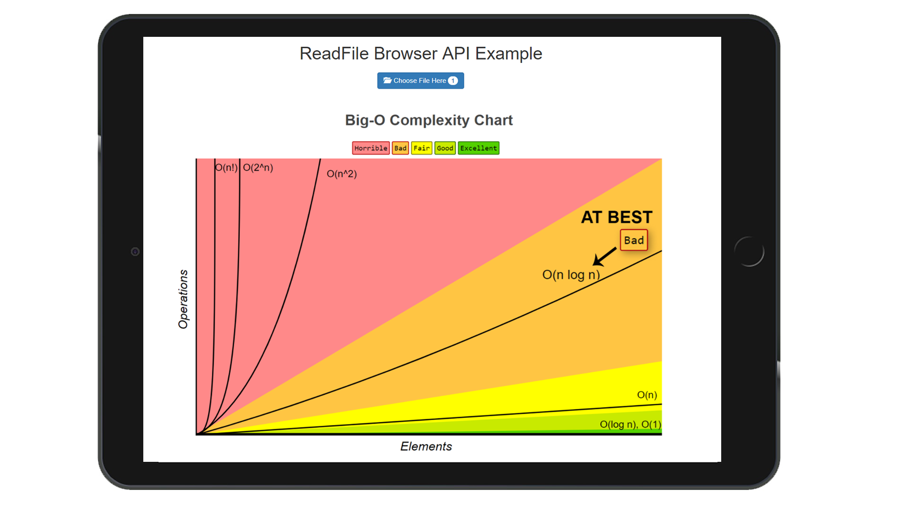

## ReadFile API

```javaScript
> git clone
> cd readfile_browser_api
```
## Project View



#### Key features
<hr> 

> ReadFile API

> Download Image file to browser

> View image in browser

> Practical example

> Commented code for reference

#### Links

> [Video](https://youtu.be/X57mh8tKkgE)

> [Associated article to add Blur effects to image](https://developers.google.com/web/updates/2017/10/animated-blur)